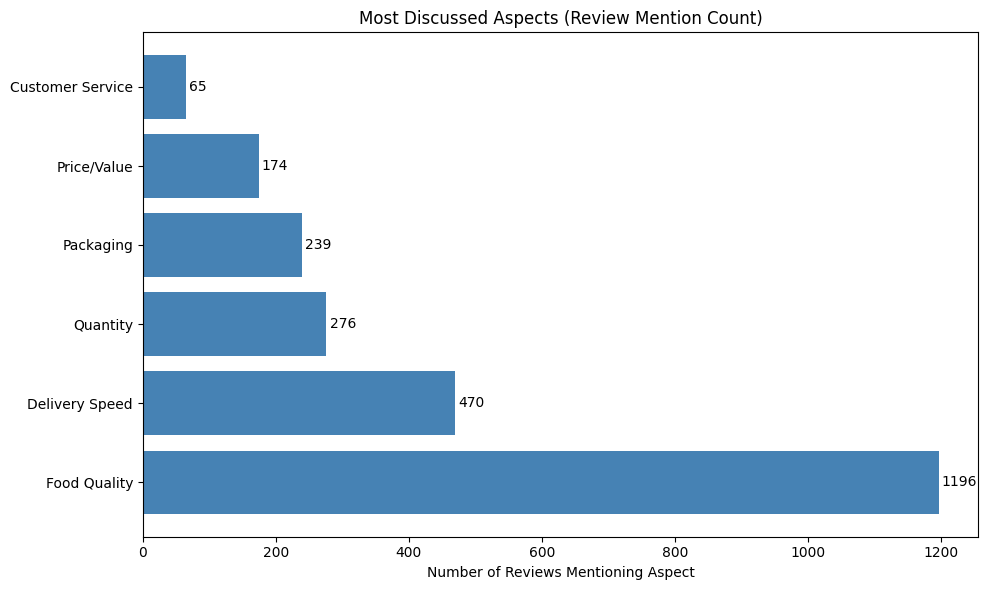
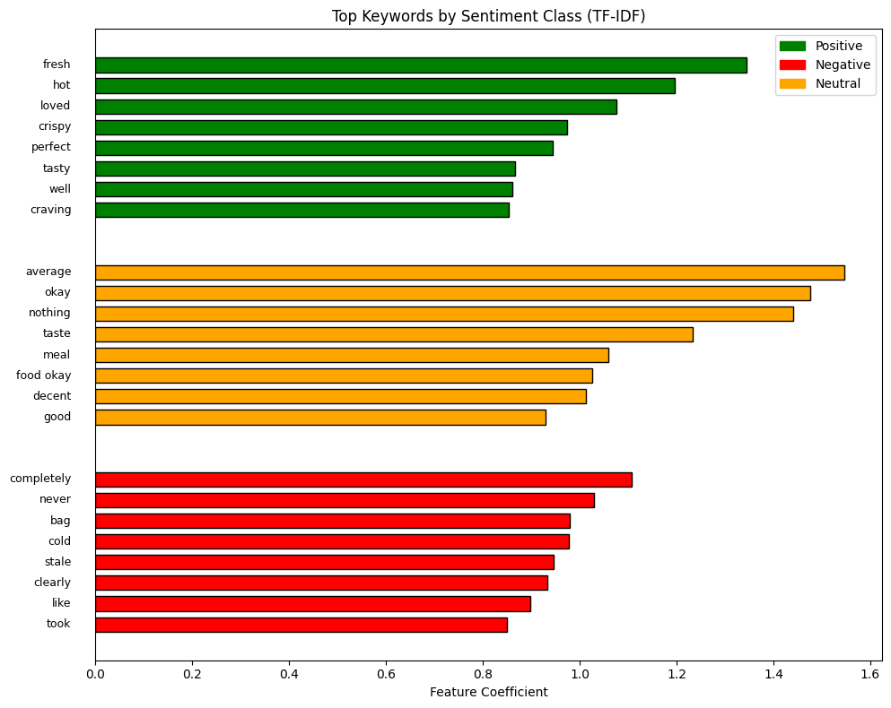
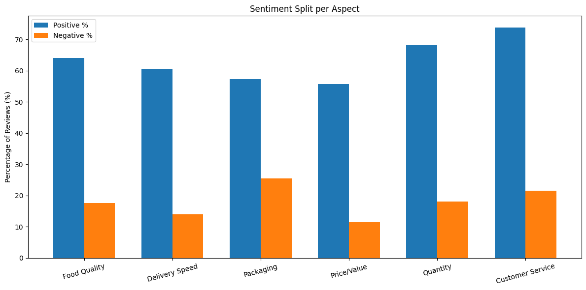
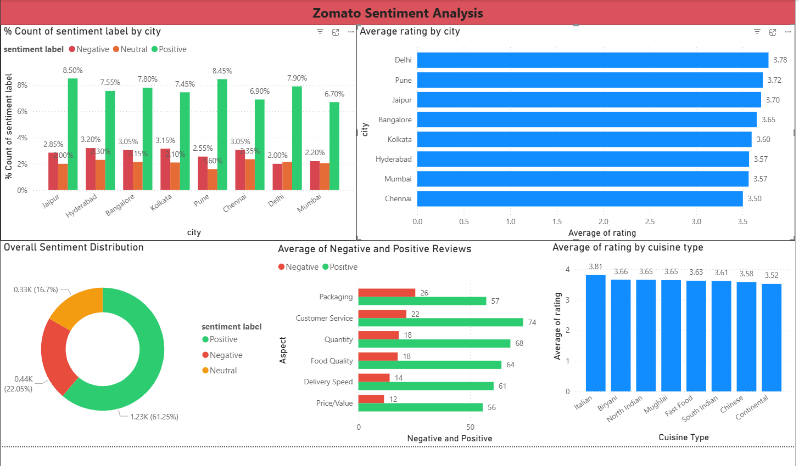

# Zomato-Sentiment-Analysis
An end-to-end NLP project analyzing customer reviews from Zomato using Python, Machine Learning, and Power BI to uncover customer satisfaction drivers across delivery, food quality, and pricing.

## Objective
To analyze 2,000 Zomato restaurant reviews across 8 Indian cities and automatically classify customer sentiment as Positive, Neutral, or Negative — while identifying which aspects (food quality, delivery, packaging, price) drive customer satisfaction or dissatisfaction.

## Tools Used

| Tool | Purpose |
|------|---------|
| Python (Pandas, NumPy, Matplotlib, Seaborn) | Data cleaning and exploratory data analysis |
| NLTK, VADER | Text preprocessing and unsupervised sentiment scoring |
| Scikit-learn (TF-IDF, Logistic Regression) | Feature extraction and sentiment classification |
| Power BI | Interactive dashboard and data visualization |

## Dataset

Source: Synthetically generated dataset modelled on real-world Zomato review patterns
Size: 2,000 rows, 9 columns
Description: Customer reviews from 20 restaurants across 8 Indian cities covering 8 cuisine types


## Features

| Column | Description |
|--------|-------------|
| review_id | Unique review identifier |
| restaurant_name | Name of the restaurant |
| cuisine_type | Type of cuisine |
| city | City where the restaurant is located |
| rating | Customer rating (1 to 5) |
| delivery_time_mins | Delivery time in minutes |
| order_value_inr | Order value in Indian Rupees |
| review_text | Raw customer review text |
| sentiment_label | Ground truth sentiment (Positive / Neutral / Negative) |


## Project Workflow
```
Raw CSV Data
     ↓
Text Preprocessing (Lowercase, Remove Punctuation, Stopword Removal, Lemmatization)
     ↓
VADER Sentiment Scoring (Unsupervised Baseline)
     ↓
TF-IDF Vectorization
     ↓
ML Classification (Logistic Regression + Naive Bayes)
     ↓
Aspect-Based Sentiment Analysis
     ↓
Power BI Dashboard (Interactive Visuals, City Slicer)
```

## Steps

### 1. Text Preprocessing (Python)

- Converted review text to lowercase

- Removed punctuation and numbers using regex

- Removed stopwords using NLTK English stopwords corpus

- Applied lemmatization using WordNetLemmatizer to reduce words to root form

### 2. VADER Sentiment Scoring (Unsupervised)

- Applied VADER SentimentIntensityAnalyzer on raw review text

- Generated compound score ranging from -1 to +1

- Classified sentiment using threshold: compound ≥ 0.05 = Positive, ≤ -0.05 = Negative, else Neutral

- Achieved 67.1% accuracy as unsupervised baseline

### 3. TF-IDF Vectorization + ML Classification (Supervised)

- Vectorized cleaned text using TF-IDF (max 3,000 features, bigrams, min_df=2)

- Final vocabulary: 682 meaningful features after filtering

- Split data 80/20 with stratification to maintain class balance

- Both models achieved 96.2% accuracy — a 29% improvement over VADER

### 4. Aspect-Based Analysis

- Identified 6 key aspects: Food Quality, Delivery Speed, Packaging, Price/Value, Quantity, Customer Service

- Used keyword matching with str.contains() to find reviews mentioning each aspect

- Calculated positive and negative sentiment percentage per aspect

### 5. Power BI Dashboard

- Loaded scored CSV into Power BI Desktop

- Built 6 interactive visuals with a city slicer

- Created aspect summary chart using exported aspect CSV


## Key Insights

1. **Supervised ML significantly outperforms rule-based scoring** — Logistic Regression achieved 96.2% accuracy vs VADER's 67.1%, proving that labeled historical data enables far more accurate sentiment classification.

2. **Packaging has the highest negative sentiment** — 26% of packaging-related reviews are negative, making it the most complained-about aspect. Zomato should prioritize spill-proof, tamper-evident packaging.

3. **Delhi has the highest average rating (3.78), Chennai the lowest (3.50)** — Significant city-wise variation suggests regional operational differences that need targeted improvement.

4. **Food Quality is the most discussed aspect** — Appearing in the highest number of reviews, food quality drives both the strongest positive and negative sentiment.

5. **Price/Value has the lowest negative sentiment (11%)** — Customers generally feel Zomato offers good value for money, suggesting pricing is not a major pain point.

6. **Customer Service has the highest positive sentiment (74%)** — Customers are generally satisfied with support interactions.


## Visualizations

### Most Discussed Aspects


### Top Keywords by Sentiment Class (TF-IDF)


### Sentiment Split per Aspect


### Power BI Dashboard



